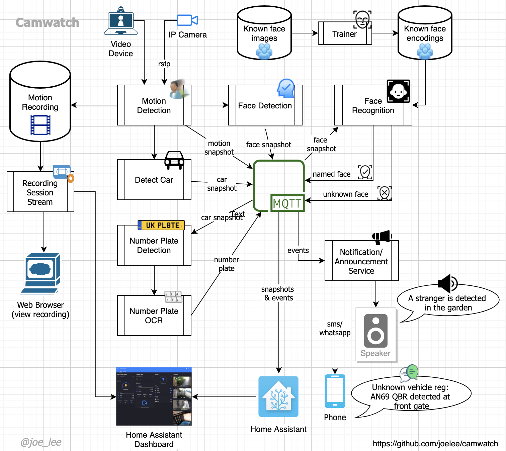

# CamWatch
Face and Car detector from video streams using Computer Vision 
with Face Recognition and Car Number Plate detection for integration
with MQTT and Home Assistant

## Features
- Records video on motion detection
- Detect faces and cars
- Train to recognise faces from image files
- Publish events and snapshots to MQTT
- integration with Home Assistant
- extensive user configurable parameters for tuning video sources to correct false positive

> This project is still under-development and some features (e.g. Number Plate detection) are not available.
> 
> Further updates and documentation improvement are coming in the next few days.
 

## Quick Start

### Installation
- `git clone https://github.com/joelee/camwatch.git`
- `cd camwatch`
- `python -m pip inatall -m requirements.txt`

### Configuration
- `cp config/camwatch-quick_start.yaml config/camwatch.yaml`
- Edit and customise `config/camwatch.yaml`
- see `camwatch-defaults.yaml` for more settings

### Start monitoring a video channel
- `python src/capture.py {channel_name}`

### Start face recognition training
- Set the path of your training data in the configuration: `services.face_recognition.location`
- Add the face photos under named sub-folders, e.g.:
    - `john/`
        - `john_photo1.jpg`
        - `john_photo2.jpg`
    - `jill/`
        - `jill_photo1.jpg`
        - `jill_photo2.jpg`
- Start trainer: `python src/face_trainer.py`
    

