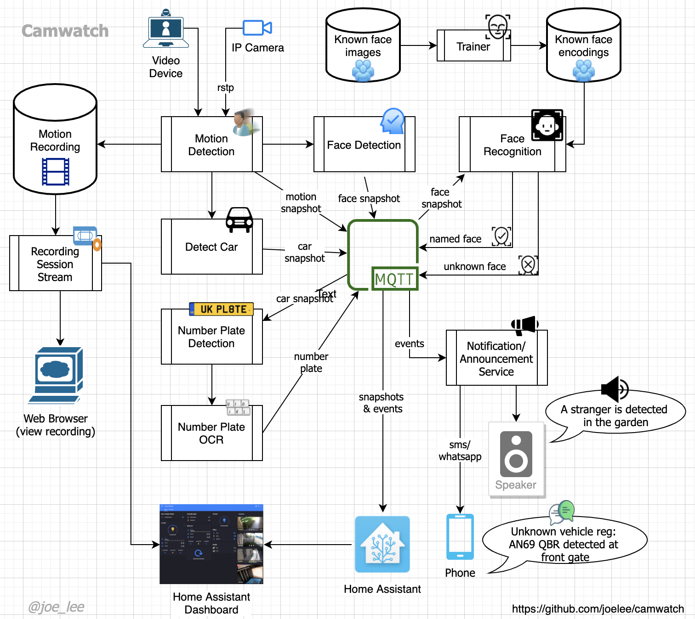

# CamWatch
Face and Car detector from video streams using Computer Vision 
with Face Recognition and Car Number Plate detection for integration
with MQTT and Home Assistant

## Features
- Records video on motion detection
- Detect faces and cars
- Train recognising faces from image files
- Detect and OCR Car Number plates  
- Publish events and snapshots to MQTT
- integration with Home Assistant
- extensive user configurable parameters for tuning video sources to correct false positives

> This project is still under-development.
> 
> Further updates and documentation improvement are coming soon.
 

## Quick Start

### Installation
- `git clone https://github.com/joelee/camwatch.git`
- `cd camwatch`
- Install `uv`: https://docs.astral.sh/uv/getting-started/installation/
- Install native build/runtime dependencies required by OpenCV, dlib, and Tesseract on your system
- `uv venv --python 3.14.3`
- `uv sync`
- `requirements.txt` is deprecated and only kept temporarily for compatibility
- Face recognition is optional on Python 3.14 for now; try `uv sync --extra face` only after installing native build tooling and validating `dlib`

### Configuration
- `cp config/camwatch-quick_start.yaml config/camwatch.yaml`
- Edit and customise `config/camwatch.yaml`
- see `camwatch-defaults.yaml` for more settings

### Start monitoring a video channel
- `uv run python src/capture.py {channel_name}`

### Start face recognition training
- Set the path of your training data in the configuration: `services.face_recognition.location`
- Install the optional face stack first: `uv sync --extra face`
- Add the face photos under named sub-folders, e.g.:
    - `john/`
        - `john_photo1.jpg`
        - `john_photo2.jpg`
    - `jill/`
        - `jill_photo1.jpg`
        - `jill_photo2.jpg`
- Start trainer: `uv run python src/face_trainer.py`
    
